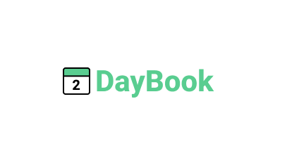

# DayBook

Esse aplicativo é semelhante ao programa Calendly(https://calendly.com/pt) onde você disponibiliza uma agenda para que outras pessoas possam marcar um horário com você.

## Finalidade
Esse aplicativo foi criado para que as regras do CleanCode e CleanArchitecture sejam aplicadas em um projeto real.

## Design
Esse é o link do design do aplicativo: https://www.figma.com/file/52Gq76MxB0ccQQZ0Y9tevT/DayBook?type=design&node-id=3%3A2&mode=design&t=4HmShho7o3DtZhGV-1